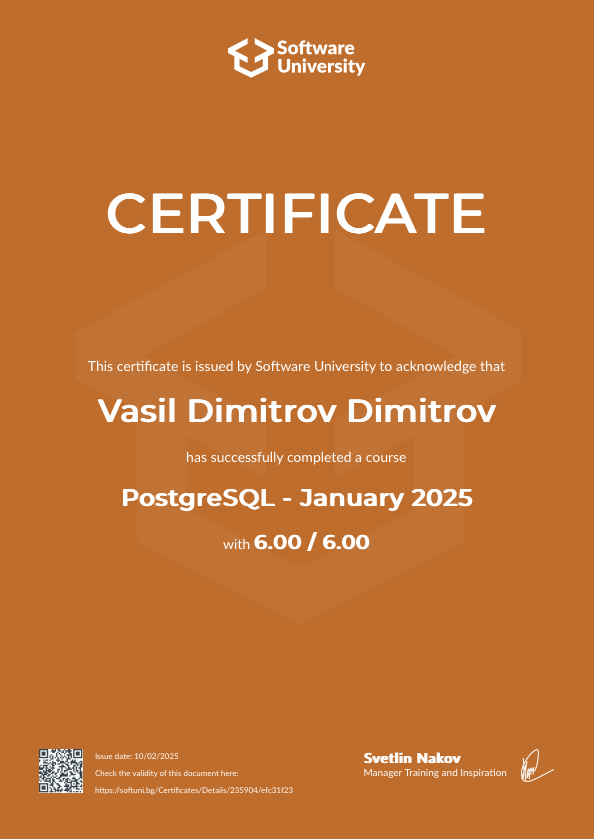
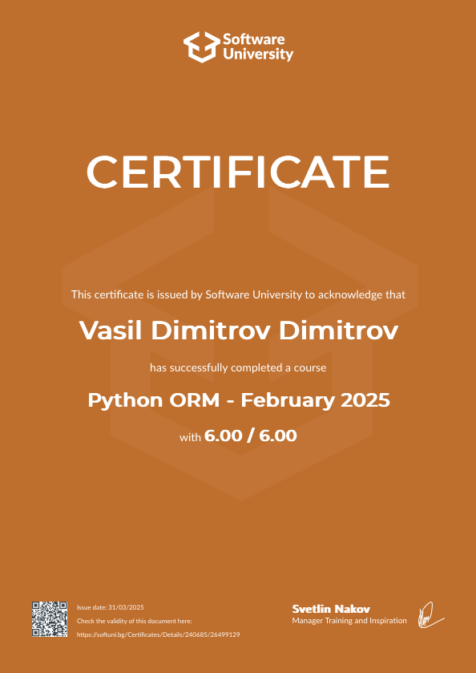

Hi I'm Vasil Dimitrov

Software Engineering student with Python
* 🌍  I'm based in Bulgaria
* ✉️  You can contact me at vasil.dimitrov.dev@gmail.com
* 🧠  I'm learning Python, in SoftUni. In addition to my program, I study JS, HTML & CSS as part of my training as a software engineer
* 🤝  I'm open to collaborating on projects for beginners on Python
* ⚡  Debugging is like being the detective in a crime movie where you are also the murderer
* 🌐 **[The Nail Lab PetqG](https://the-nail-lab.onrender.com)** — website, built on Django. **[Link to repository](https://github.com/Zeus097/the_nail_lab_website)**

# 

### Skills  

  
 

  
 
  
  
  
  

  

  

  

  

  

  
  

 Badges

<b>My GitHub Stats</b>

